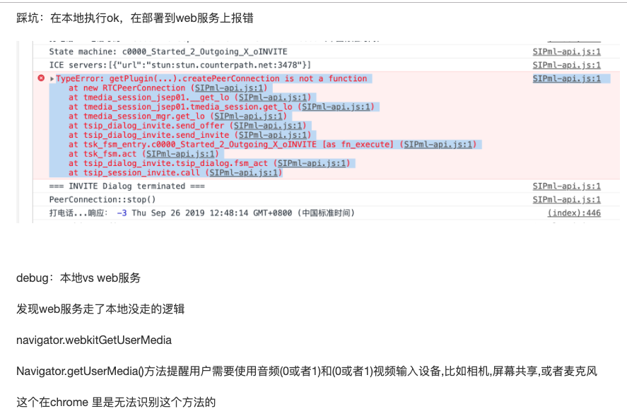
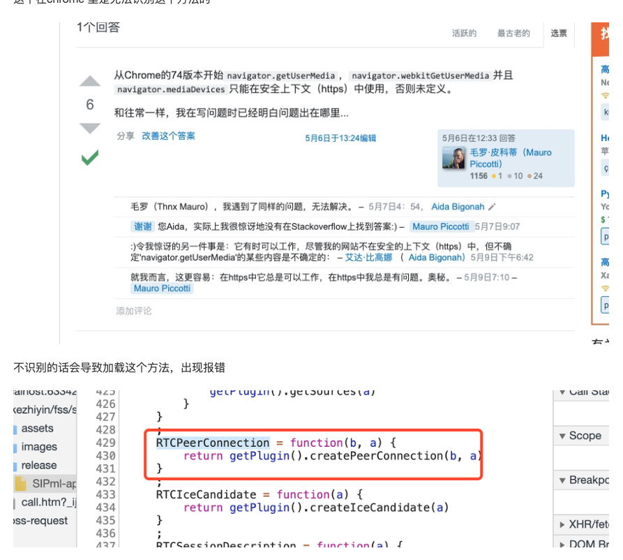

## 一、docker 部署

1. 预备内容

   1. sipml5 GitHub ： https://github.com/DoubangoTelecom/sipml5
   2. freeswitch GitHub：https://github.com/BetterVoice/freeswitch-container

2. docker commnd 启动容器

   1. https://github.com/BetterVoice/freeswitch-container#running-the-container

      按照官网提示，挂载一个新的目录，到docker里，然后将配置文件 cp -r 到宿主目录，

      然后 修改docker 启动 挂载配置文件。

   2. 证书目录也要挂载宿主机目录

   ```
   sudo docker run --name fss -v /home/lishulong/freeswitch/conf:/usr/local/freeswitch/conf -v /home/lishulong/freeswitch/certs:/usr/local/freeswitch/certs -p 5060:5060/tcp -p 5060:5060/udp -p 5080:5080/tcp -p 5080:5080/udp -p 8021:8021/tcp -p 5066:5066/tcp  -p 7443:7443/tcp -p 16384-16484:16384-16484/udp --privileged=true -d  bettervoice/freeswitch-container:1.6.16
   ```

3. 修改配置文件

   1. var.xml 

      ```xml
      <!-- 设置宿主机IP--> 
      <X-PRE-PROCESS cmd="set" data="external_rtp_ip=192.168.1.20"/>
      <X-PRE-PROCESS cmd="set" data="external_sip_ip=192.168.1.20"/>
      ```

      

   2. autoload_configs

      1. /event_socket.conf.xml

         ```shell
         [ERROR] fs_cli.c:1659 main() Error Connecting [Socket Connection Error]
         
         在freeswitch 容器内执行fs_cli 报错解决
         修改listen-ip属性为 0.0.0.0
         ```

      2. /switch.conf.xml

         ```xml
         <!-- RTP port range 	和docker外层映射的开放端口一致 ,映射范围太大，启动速度越慢-->
         <param name="rtp-start-port" value="16384"/>
         <param name="rtp-end-port" value="16484"/>
         ```

   3. sip_profiles

      1. /internal.xml

         ```xml
         <!--设置宿主机Ip -->
         <param name="ext-rtp-ip" value="192.168.1.20"/>
         <param name="ext-sip-ip" value="192.168.1.20"/>
         
         <!-- for sip over websocket support -->
         <param name="ws-binding" value=":5066"/>
         
         <!-- for sip over secure websocket support -->
         <!-- You need wss.pem in $${certs_dir} for wss or one will be created for you -->
         <param name="wss-binding" value=":7443"/>
         ```

4. 注意事项

   1. 以上部署完成，就能实现sip客户端（xlite） freeswitch sip客户端（xlite） 之间进行通话


## 二、实现网页版语音通话

##### 需要知道的一些概念

*WebRTC*

> 网页即时通讯，web real-time communication

*ICE服务器* 

> ICE是ZEROC的开源通信协议产品，它的全称是：The Internet Communications Engine，翻译为中文是互联网通信引擎，是一个面向对象的中间件，使我们能够以最小的代价构建分布式应用程序。ICE使我们专注于应用逻辑的开发，它来处理所有底层的网络接口编程，这样我们就不用去考虑这样的细节：打开网络连接、网络数据传输的序列化与反序列化、连接失败的尝试次数等。

STUN https://www.voip-info.org/stun/

> STUN（通过NAT的UDP简单穿越（网络地址转换））是一种协议，用于协助NAT防火墙或路由器后面的设备进行数据包路由。RFC 5389将术语STUN重新定义为“用于NAT的会话遍历实用程序”。

##### *实现方式*

1. https://sipjs.com/

2. https://www.doubango.org/sipml5/

3. https://jssip.net/


### 本地调试使用的是sipml5 + webrtc 

1. 在本地使用ws http


## 三、踩坑






有两种方式：

1. 修改源码，修改后可能存在其他问题
2. 修改为https+wss(采纳)


